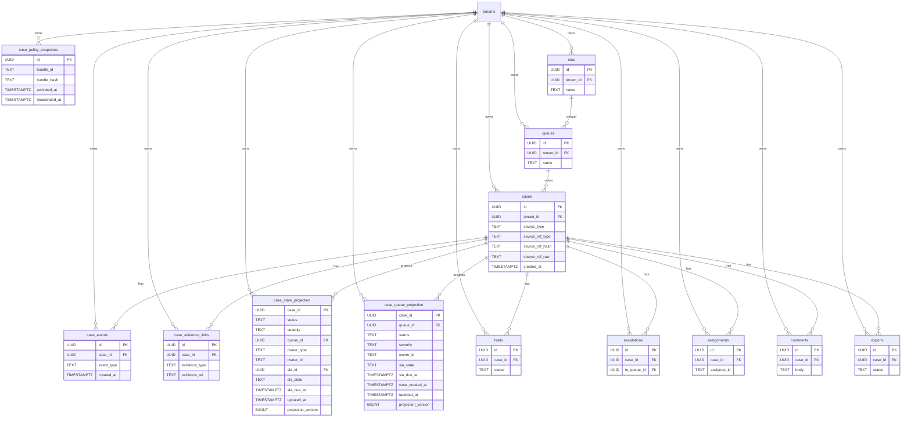

# Phase 4B Case Management Spec (v0)

This document locks the Case Management domain model and hard constraints for Phase 4B.0.

## Scope
- Define canonical entities and invariants for case management and moderator workflows.
- Establish lifecycle state machine and required event types.
- Define idempotency rules, multi-tenant boundaries, and retention constraints.
- Provide OpenAPI v1 endpoint list (no implementation).

## Non-goals (avoid dashboard bloat)
- No detection, watermarking, or ML scoring logic in case workflows.
- No generic analytics dashboards beyond case-centric queue views.
- No free-form custom fields that bypass schema review.
- No deletion or mutation of evidence; redaction is an event, not a delete.
- No cross-tenant sharing of cases, evidence, or events.
- No custom workflow builder; workflows are fixed and audited.

## Canonical Definitions
### Case
A tenant-scoped review record created from a system trigger or human action.
Canonical identity fields only; all mutable state is derived from events.
Key fields: `case_id`, `tenant_id`, `source_type`, `source_ref_type`,
`source_ref_hash`, `source_ref_raw`, `created_at`.

### Evidence
Immutable references that support a case decision.
Examples: artifact hashes, verification receipts, derivation graph snapshots, policy decisions.
Evidence is linked to cases and is never overwritten or deleted.

### Claim
A structured statement about evidence (human or system), recorded as an event payload.
Claims do not alter evidence; they add interpretation or context.

### Decision
The authoritative outcome for a case (allow, label, require_review, block).
Decisions are recorded as events and reference policy bundle hashes and rationale.

### Hold
A time-bound or indefinite pause that stops SLA timers.
Holds are recorded as events; active holds are derived state.

### Escalation
A routing action that moves a case to a higher queue or different reviewer group.
Escalations are recorded as events and capture from/to queue and reason.

### Queue
A work queue that defines routing and default SLA configuration.
Queues are per-tenant and are used for triage and assignment.

### SLA
Time expectations for a queue or case (warn and breach thresholds).
SLA timers are computed by the workflow service and logged as events.

### Assignment
The current reviewer or system agent responsible for a case.
Assignments are events; current assignment is derived state.

### AuditEvent
A system-wide append-only log entry (existing `audit_events`) that mirrors case actions
for compliance and traceability.

## Event Envelope (all case events)
Each case event must include:
`event_id`, `tenant_id`, `case_id`, `event_type`, `actor_type`, `actor_id`,
`request_id`, `created_at`, `payload`.
`request_id` is required for idempotency and dedupe.

## Invariants
- `case_events` is the canonical truth; no UPDATE or DELETE.
- `cases` is an immutable header row; no UPDATE or DELETE.
- Case status, queue, owner, and SLA fields are projections derived from events.
- Evidence links are immutable once attached (redactions are separate events).
- Decisions are events, never direct state changes.
- All rows are tenant-scoped; no cross-tenant joins or references.
- Derived tables can be rebuilt from `case_events` for integrity checks.

## Truth Model and Projections
Canonical truth lives in:
- `case_events` (all actions and system changes)
- `case_evidence_links` (immutable evidence references)
- `case_policy_snapshots` (immutable policy snapshot records)

Projections (rebuildable):
- `case_state_projection` (current status, owner, SLA, queue)
- `case_queue_projection` (queue-optimized view)
- Optional typed tables (`holds`, `escalations`, `assignments`, `comments`, `exports`) are
  append-only fact tables derived from events or written by the same command handler.
  Status changes are new rows, not updates.

Projection integrity:
- `projection_version` increments with projector deployments.
- A periodic job replays events to rebuild projections and diffs results.

## Projector Contract (Required)
API handlers write only:
- `case_events`
- `case_evidence_links`
- `case_policy_snapshots`

Projector is the sole writer for:
- `case_state_projection`
- `case_queue_projection`
- typed fact tables (`holds`, `escalations`, `assignments`, `comments`, `exports`)

Suggested DB roles:
- `case_api_writer`: INSERT on `case_events`, `case_evidence_links`, `case_policy_snapshots`
- `case_projector_writer`: INSERT/UPDATE on projection tables and typed fact tables

Typed fact tables are append-only. Status changes are new rows, not updates.

## Lifecycle State Machine

Notes:
- System can skip intermediate states (for example, create + assign).
- `case.decided` defines the authoritative decision and transitions to RESOLVED.
- `case.reopened` requires a reason and creates a new review cycle.

## Required Event Types
| event_type | actor | notes |
| --- | --- | --- |
| case.created | system/human | creates the case and initial queue |
| case.evidence_added | system/human | links immutable evidence reference |
| case.evidence_redacted | legal/system | records redaction without deleting link |
| case.evidence_accessed | system/human | any raw evidence or export retrieval |
| case.comment_added | human | adds rationale or notes |
| case.assigned | human/system | assigns owner |
| case.unassigned | human/system | clears owner |
| case.review_started | human | starts active review |
| case.hold_placed | legal/human | pauses SLA timers |
| case.hold_released | legal/human | resumes SLA timers |
| case.escalated | human/system | routes to new queue |
| case.deescalated | human/system | returns to previous queue |
| case.decided | human | decision action + policy_snapshot_id + policy refs |
| case.reopened | human | reopens after new evidence |
| case.closed | system | final closure / retention state |
| case.sla.reminder | system | SLA reminder fired |
| case.sla.breached | system | SLA breach recorded |
| case.assignment_expired | system | assignment expired (workflow-owned) |
| case.auto_escalated | system | automatic escalation (workflow-owned) |
| case.export_requested | human | export started |
| case.export_completed | system | export completed with hash |
| case.export_failed | system | export failure with error |

## Idempotency Rules
- Case creation is keyed by `(tenant_id, source_type, source_ref_hash)`.
- Duplicate create with the same canonical key returns the existing case.
- Event creation requires `request_id`; duplicates return existing event.
- Evidence linking is idempotent on `(tenant_id, case_id, evidence_type, evidence_ref)`.
## Request ID Requirements
- `request_id` is required for all case actions and system events.
- Typed fact tables must enforce unique `(tenant_id, case_id, request_id)`.

### Canonical Source Reference
Cases must use canonicalized source references to avoid formatting drift.

Fields:
- `source_ref_type`: one of `subject_hash`, `artifact_hash`, `manifest_id`,
  `receipt_id`, `external_ticket`.
- `source_ref_hash`: `sha256` over canonical bytes of the source ref.
- `source_ref_raw`: optional display value (never used for identity).

Canonicalization examples:
- `manifest_id`: lowercase UUID string.
- `artifact_hash`/`subject_hash`: lowercase hex string.
- `external_ticket`: `vendor` + ":" + normalized ticket id (lowercase, trimmed).

## Multi-tenant Boundaries and Retention
- All entities include `tenant_id` and must be filtered by tenant in every query.
- Retention rules apply to derived views, not event or evidence logs.
- Evidence links are never deleted; redaction is an event with reason and actor.

## RBAC / Capability Matrix
| capability | moderator | supervisor | legal/compliance | auditor | system |
| --- | --- | --- | --- | --- | --- |
| view_case | yes | yes | yes | yes | yes |
| list_queue | yes | yes | yes | yes | yes |
| assign/unassign | yes | yes | no | no | yes |
| hold/unhold | no | yes | yes | no | yes |
| escalate/deescalate | no | yes | yes | no | yes |
| decide/resolve | yes | yes | yes | no | no |
| add_comment | yes | yes | yes | no | yes |
| export_evidence | no | yes | yes | yes | yes |

## OpenAPI v1 Endpoint List (Case API + Workflow API)
Case API:
- `POST /v1/cases` (idempotent create)
- `GET /v1/cases/{case_id}`
- `GET /v1/cases` (filters: tenant_id, status, queue_id, owner, severity, sla_state, time ranges)
- `GET /v1/cases/{case_id}/events`
- `POST /v1/cases/{case_id}/evidence`
- `POST /v1/cases/{case_id}/comments`
- `POST /v1/cases/{case_id}/assign`
- `POST /v1/cases/{case_id}/unassign`
- `POST /v1/cases/{case_id}/hold`
- `POST /v1/cases/{case_id}/unhold`
- `POST /v1/cases/{case_id}/escalate`
- `POST /v1/cases/{case_id}/deescalate`
- `POST /v1/cases/{case_id}/decide`
- `POST /v1/cases/{case_id}/reopen`
- `POST /v1/cases/{case_id}/exports`
- `GET /v1/exports/{export_id}`

Policy snapshot API (Policy Service):
- `POST /v1/policy-snapshots`
- `GET /v1/policy-snapshots/{policy_snapshot_id}`
- `GET /v1/policy-snapshots` (filters: tenant_id, bundle_id, active_at)

Workflow API (Temporal wrapper):
- `POST /v1/workflows/cases/{case_id}:start`
- `POST /v1/workflows/cases/{case_id}:signal` (assign, hold, unhold, escalate, resolve)
- `GET /v1/workflows/cases/{case_id}`
- `POST /v1/workflows/cases/{case_id}:terminate`

## Policy Snapshots
Policy snapshots are immutable records of policy state used for decisions.
`case.decided` events must reference:
- `policy_snapshot_id`
- `bundle_hash`
- `evaluator_version`

Snapshot fields:
`policy_snapshot_id`, `tenant_id`, `bundle_id`, `bundle_hash`, `bundle_uri`,
`activated_at`, `deactivated_at`, `actor_id`, `created_at`.

Active window invariant:
- No overlapping active windows for the same `(tenant_id, bundle_id)`.
- Query “policy at time T” using `activated_at <= T` and `(deactivated_at IS NULL OR deactivated_at > T)`.
- Enforced in Postgres via the `no_overlap_policy_windows` exclusion constraint on
  `tstzrange(activated_at, COALESCE(deactivated_at, 'infinity'::timestamptz), '[)')`
  using `btree_gist` for `(tenant_id, bundle_id)` equality.

## Workflow Contract (Temporal)
Temporal is execution only; business truth is in `case_events`.

Workflow identity:
- `workflow_id = "case:" + tenant_id + ":" + case_id`

Signals (idempotent by `request_id`):
- `Assign`, `Hold`, `Unhold`, `Escalate`, `Resolve`, `CommentAdded`

Workflow-emitted system events (only):
- `case.sla.reminder`
- `case.sla.breached`
- `case.assignment_expired`
- `case.auto_escalated`
- `case.closed` (optional)

Determinism rules:
- No external IO in workflows.
- All timers use workflow time.
- Activities must be idempotent by `request_id`.

## Evidence Access Boundary
- UI reads metadata only; raw evidence bytes require explicit capability.
- API never streams blobs; it only issues pre-signed URLs.
- All evidence/blob downloads emit `case.evidence_accessed` events before URL issuance.
- Export downloads are audited and time-limited (pre-signed URLs).
- Export manifests are signed and the export hash is recorded in `case.export_completed`.

## Threat Model (Phase 4B.0)
- Tamper: enforce append-only case_events and evidence links; optional event hash chain.
- Privilege escalation: strict RBAC checks on human actions and exports.
- Data leakage: tenant scoping on all queries; export access logged and audited.
- Export abuse: rate limits, capability checks, and append-only export events.

## ERD (Mermaid)

